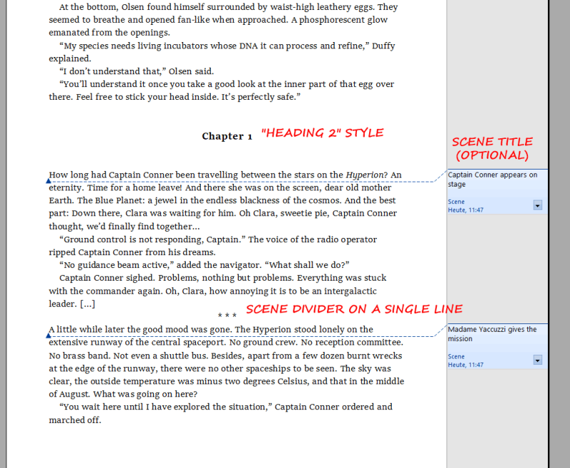

# odt2nw

Generate a novelWriter project from a work in progress written with e.g. *LibreOffice*.  

## Features

- Converts three levels of the novel structure: Parts, chapters, and scenes.

## Requirements

- [Python](https://www.python.org/) version 3.6+.

## Download link

[https://raw.githubusercontent.com/peter88213/odt2nw/main/odt2nw.py](https://raw.githubusercontent.com/peter88213/odt2nw/main/odt2nw.py)

## Instructions for use

### Command line usage

You can either

- launch the program on the command line passing the *.odt* file as an argument, or
- launch the program via a batch file.

usage: `odt2nw.py [-h] [--silent] Sourcefile`

#### positional arguments:

`Sourcefile` 

The path of the *.odt* file. 

#### optional arguments:

`-h, --help` 

show this help message and exit

`--silent` 

suppress error messages and the request to confirm overwriting

## How to set up a work in progress for conversion

It is assumed that very few types of text markup are needed for a fictional text:

- *Emphasized* (usually shown as italics).
- *Strongly emphasized* (usually shown as capitalized).
- *Citation* (paragraph visually distinguished from body text).

A work in progress has no third level heading.

- *Heading 1* → New Part title.
- *Heading 2* → New chapter title.
- `* * *` → Scene divider (not needed for the first scenes in a
  chapter).
- Comments right at the scene beginning are considered scene titles.
- All other text is considered scene content.
- Text markup: Bold and italics are supported. Other highlighting such
  as underline and strikethrough are lost.
- Paragraphs formatted as *Quote* start with `"> "` in novelWriter.

---

---

## Credits

- Frederik Lundh published the [xml pretty print algorithm](http://effbot.org/zone/element-lib.htm#prettyprint).

## License

odt2nw is distributed under the [MIT License](http://www.opensource.org/licenses/mit-license.php).

---

## See also

### nw_metadata

Create a cross reference table with novelWriter metadata. 

[nw_metadata](https://github.com/peter88213/nw_metadata)

### mm2nw

Generate a novelWriter project from a FreeMind/Freeplane outline.

[mm2nw](https://github.com/peter88213/mm2nw/)

### md2nw

Generate a novelWriter project from a work in progress written with any text editor or Markdown word processor.

[md2nw](https://github.com/peter88213/md2nw/)

### yw2nw

Converter between yWriter and novelWriter.

